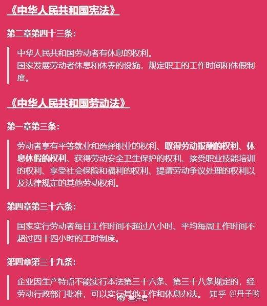

996.ICU指工作996、生病ICU（重症加强护理病房），也就是工作从早上9点上班到晚上9点下班，每周工作6天，生病了就住进ICU。2019年3月27日，一个名为996.ICU的项目在GitHub上传开。程序员们揭露“996ICU”互联网公司，抵制互联网公司的996工作制度。在一周之内，华为、阿里巴巴、蚂蚁金服、京东、58同城、苏宁、拼多多、大疆……一个个互联网头部公司先后上榜。
&nbsp;
4月11日马云老师在阿里巴巴内部交流活动上分享到：
&nbsp;
关于996，现在这是国内的一个很热门的话题，很多企业都有这个问题。我个人认为，能做996是一种巨大的福气，很多公司、很多人想996都没有机会。如果你年轻的时候不996，你什么时候可以996？你一辈子没有996，你觉得你就很骄傲了？这个世界上，我们每一个人都希望成功，都希望美好生活，都希望被尊重，我请问大家，你不付出超越别人的努力和时间，你怎么能够实现你想要的成功？
&nbsp;

马云谈996
&nbsp;
马云的话具备很强的煽动效果，但是马上就有网友反驳他这是偷换概念，你要获得“成功”“美好生活”“尊重”等，那么你就要996。这是“归因错误”，成功和996并没有严谨的逻辑关系，难不成我不996就不能成功了？
&nbsp;
马云发声之后，刘强东也不甘寂寞，4月12日刘强东在朋友圈回应：
&nbsp;
混日子的人不是我的兄弟！真正的兄弟一定是一起拼杀于江湖，一起承担责任和压力，一起享受成功的成果的人！我是要为18万兄弟背后那18万个家庭负责，还是要留下那1%混日子的人，向他们负责？我没有选择的余地。
&nbsp;

刘强东：混日子的人不是我的兄弟！
&nbsp;
刘强东的话被网友调侃为“薛定谔的兄弟”，即在你被裁员之前，你永远不知道自己是不是东哥的兄弟。
&nbsp;
一起拼命的时候是兄弟；性价比不高、拼不动了，东哥就可以找个理由把你“优化”掉。大有兔死狗烹、鸟尽弓藏之意。
&nbsp;
招致全网骂声之后，马老师觉得还有话需要补充，于是在4月14日11:35在微博发了一篇长文“再谈996”，在文中他这样说到：
&nbsp;
但是这世界确实有很多996，甚至007的人。不仅仅是企业家，大部分成功或有追求的艺术家、科学家、运动员、官员、政治家基本上都是996以上的。不是因为他们有超常的毅力，而是因为他们超爱自己选择的事业，他们为此付出超常的奋斗和努力，才获得了常人没有的“成功”。重要的是，当一个人找到了自己热爱的事情，何止是996？吃饭睡觉都在思考、琢磨。他们为什么不去干点别的更轻松的？不是因为没得选，而是愿意干这个，这事的意义超越了金钱利益，干别的再轻松都不乐意，干这个再苦再累都感觉快乐。
&nbsp;

马云再谈996
&nbsp;
毫无疑问，马老师又被骂的更惨了，网友纷纷呼吁：马老师，拜托你闭麦吧，不要得了便宜还卖乖，败坏路人缘了。
&nbsp;
大家发现没有，这个话题，其他大佬一个个都是噤若寒蝉，选择不发声，如果说出支持996的言论，那就注定被广大的无产阶级劳动者骂的不成人样；如果说出反对996的言论，那相当于是跟自己的利益集团决裂。所以选择闭嘴好像才是最明智的做法。
&nbsp;
而这件事情发生到现在已经半个多月，都是劳动者和雇主之间在互掐，最重要的仲裁机构还没有出现。在千呼万唤之下，代表国家意志的人民日报终于发声了，也算是给这件事定了一个基调。
&nbsp;

人民日报谈996
&nbsp;
【人民日报评论：崇尚奋斗，不等于强制996】人们对“美好生活”的诉求不再是温饱时期的拼命工作赚钱，而是需要有在工作之外获得更多价值，发现兴趣、陪伴家人、寻找意义。没有人不懂“不劳无获”的道理。但崇尚奋斗、崇尚劳动不等于强制加班，不能给反对996的员工贴上“混日子”“不奋斗”的道德标签。
&nbsp;
这违背了《中国人民共和国劳动法》的规定，《劳动法》第四章第三十六条规定：国家实行劳动者每日工作时间不超过八小时、平均每周工作时间不超过四十四小时的工时制度。
&nbsp;

> 《佛说佛医经》
> 人得病有十因缘。
> 
> 一者**久坐不饭**。
> 
> 二者食无贷。
> 
> 三者忧愁。
> 
> 四者**疲极**。
> 
> 五者淫泆。
> 
> 六者嗔恚。
> 
> 七者忍大便。
> 
> 八者忍小便。
> 
> 九者制上风。
> 
> 十者制下风。
> 
> 从是十因缘生病。

人得病有十种原因：
&nbsp;
一、坐在一个地方不动窝，外加不吃东西
网虫们注意了，要经常站起来溜达溜达吃点东西;
&nbsp;
二、饮食没有节制
尤其去吃自助餐时，牢记这条。
&nbsp;
三、忧愁思虑多度
想想林黛玉多年轻就走了，前车之鉴啊!
&nbsp;
四、疲倦已极
什么叫过劳死?就是疲极!
&nbsp;
五、纵欲过度
知足常乐，无欲则刚，肯定是有道理的!
&nbsp;
六、发怒生气
可别用别人的错误惩罚自己。
&nbsp;
七、忍大便;
&nbsp;
八、忍小便
什么都能忍，这两样不能忍，活人可以被尿憋死滴!
&nbsp;
九、不打嗝、不打喷嚏;
&nbsp;
十、忍住不放屁。
&nbsp;
996就是疲极，极度疲惫，容易过劳死，
这是佛发现的客观存在，永恒不变的事实规律，
&nbsp;
特别是现在互联网搞IT的，还有生活饮食不规律，就容易得病，
&nbsp;
我之前就是搞IT的，压力大得很，本来一个月的任务要求一个周完成，实在遭不住，
老板都在给员工洗脑，一定要非常努力，才能成功（赚到钱），
&nbsp;
实际上勤劳并不能致富，累死累活顶多只能赚小钱，
勤劳只是条件之一，不是根本原因，
就好比结出苹果需要勤劳耕种，但是勤劳耕种不是结出苹果的根本原因，根本原因是苹果种子，
&nbsp;
要想赚大钱，必须要靠财布施，财布施就是财富的种子，
只有财布施才能感召贵人相助，当你经历过贵人相助，你会发现赚钱太简单，太轻松了，
勤劳致富纯粹是忽悠那些没学佛，不知道事实真相的小白，
[《佛说财富与贫穷》](https://www.kancloud.cn/luojiangtao/foshuocaifu)中有详细说明，
&nbsp;
所以马云说996是福报，这是不懂佛法，颠倒因果，
&nbsp;
大部分没学佛，不知道事实真相，被老板一洗脑，就累死累活的干，产生严重内卷，
结果呢？
当你做不动，身体得病了，就想方设法把裁掉，只能拿点基本工资，拍屁股走人，
这些人真的可怜，辛辛苦苦一辈子，生活还是解放前，
最后还得个过劳病，过劳死，
可怜之人必有可怜之处，
这些人有什么可恨之处？
&nbsp;
这些人实际上就是愚痴无知，不知道事实真相是财布施得财富，
错误的认为勤劳致富，
这是自身智慧不足，又没有向大智慧的佛陀学习的缘故，
&nbsp;
所以佛法很重要，不懂佛法吃哑巴亏。

