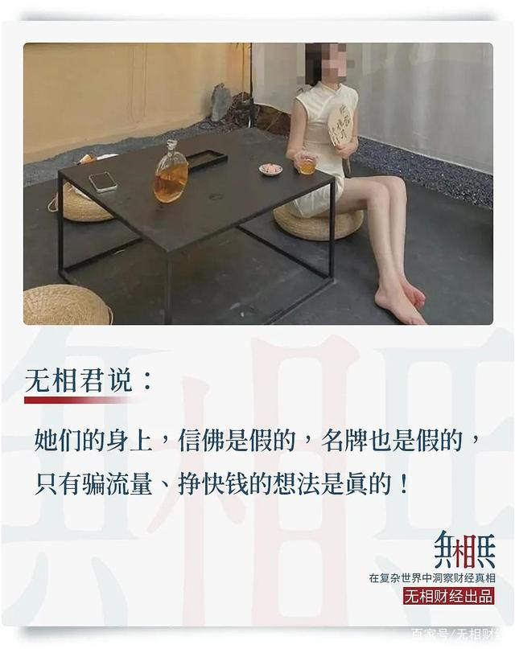

2021年09月国内掀起了一阵“佛媛”热潮。

什么是“佛媛”？

**字面上的意思是“礼佛的名媛”，拜佛+名媛。**

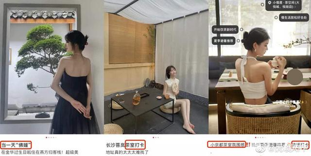

这是一群怎样的人呢？

从网上的很多照片视频中可以看到，这些佛媛，喜欢身穿名牌，衣着性感，然后到各大寺庙抄经、坐禅、吃素打卡，一副“出淤泥而不染”，衣服很露，但很虔诚的样子。

比如以下几种：

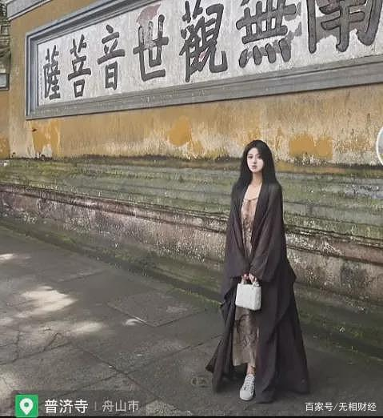

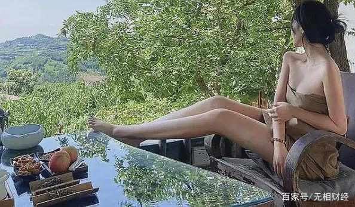

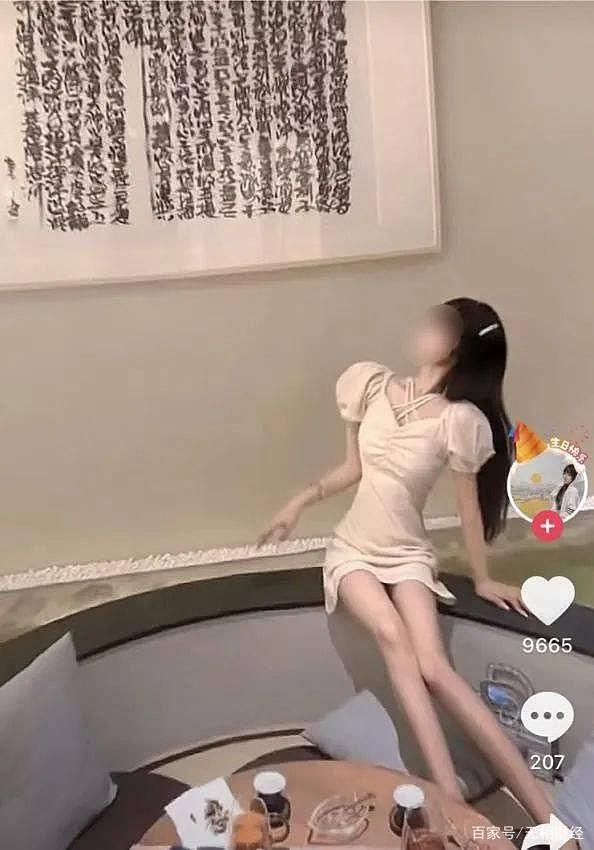

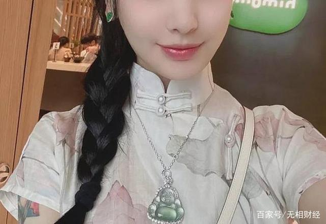

上下滑动查看图片

有美酒，有肉食；有抹胸，有短裙；有吊带，有珠宝。

但是，她们就是钟爱佛学。

**别看她们的打扮像是夜店刚出来的蹦迪女，但她们的文案，却总是那么清丽脱俗，与众不同。**

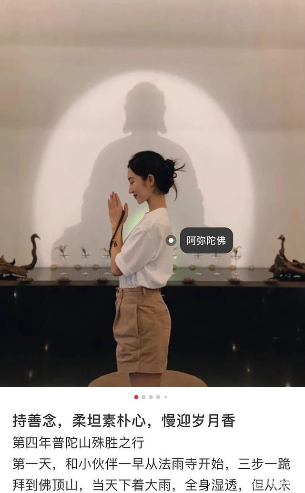

当然了，结尾还不忘念叨一句：“阿弥陀佛。”

看她们的日常，好像就是修身养性，终日抄抄佛经，敲敲木鱼，吃吃斋饭。

**至于那些名贵包包、金钗玉簪，可能……都是有助修行的法器吧。**

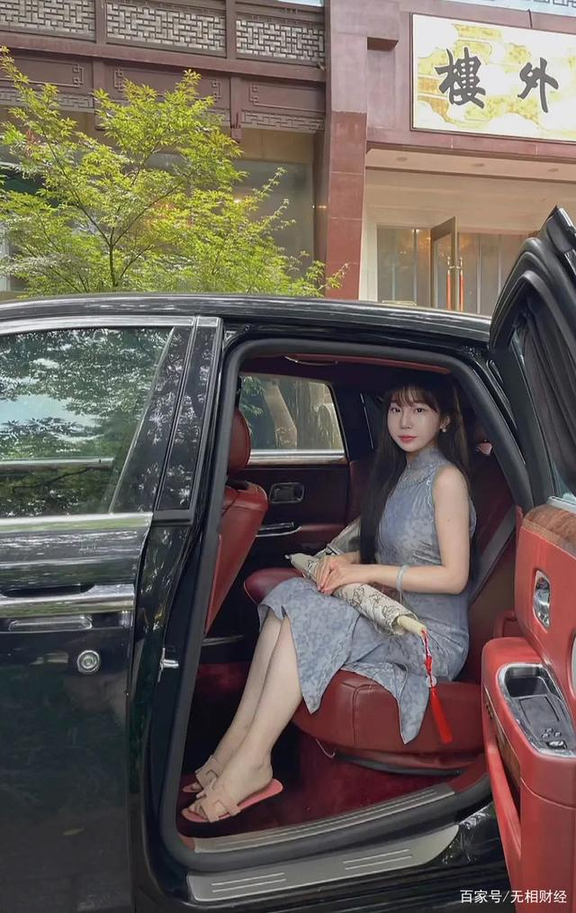

或撑着油纸伞，走在寺庙里，感受一花一世界一树一菩提。

或身着无袖高叉，在僧人的面前晃来晃去，体会岁月静好，现世安稳。

运镜成熟，姿态优雅。

活脱脱李子柒的寺庙版。

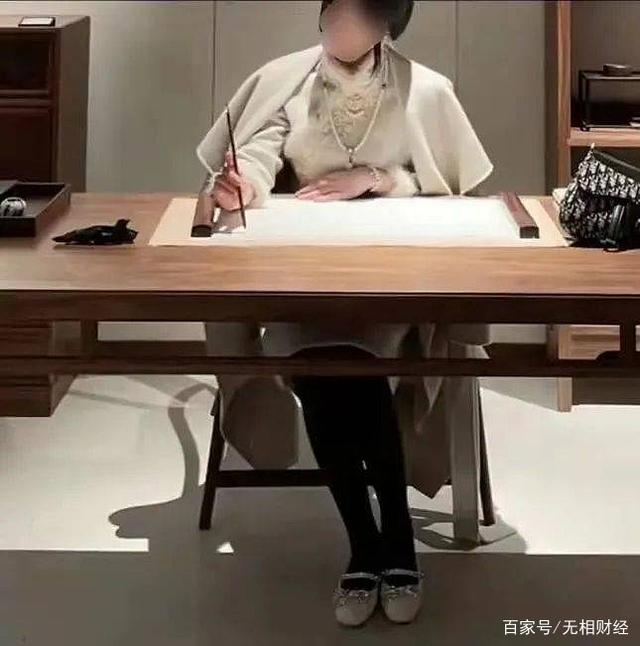

**当然，朋友圈的文案，也是必不可少的。**

什么“大悲无泪，大悟无言，大笑无声”。

什么“我在佛前偷偷为你求了平安，只有我和菩萨知道”。

什么“心静则身安，万物静观皆自得”。

简直就是超凡脱俗，句句发人深省啊。

写一幅字，配一盏茶，高雅如光风霁月，飘飘若人间谪仙。

仙乎哉？

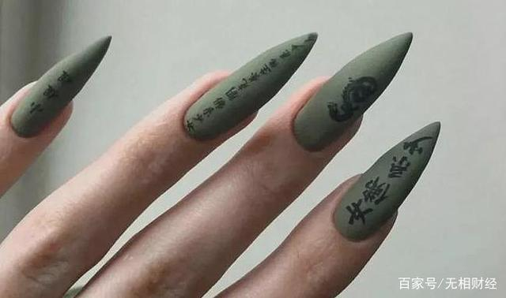

**而为了吸引眼球，有的佛媛甚至给耳垂打了玻尿酸，让耳朵饱满起来，更接近“佛相”。**

还有拿着Dior手袋的“佛媛”，敞开僧服，露出里面艳丽的碎花长裙。

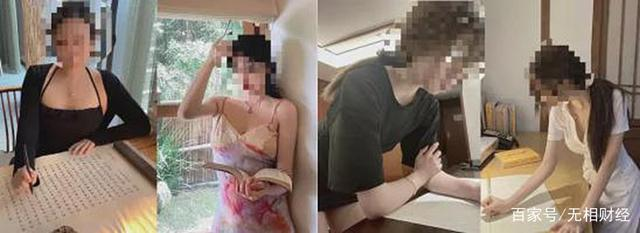

据了解，想成为“佛媛”需要四大条件。

第一是纤瘦身形；

第二，需要有一把长、直、黑的头发，不可染发，否则是“亵渎”佛祖；

第三，要化一个淡雅而精致的妆容；

第四，虽然衣着需以素色为主，但就要戴上珍珠、翡翠等名贵首饰来显示对佛祖的虔诚。

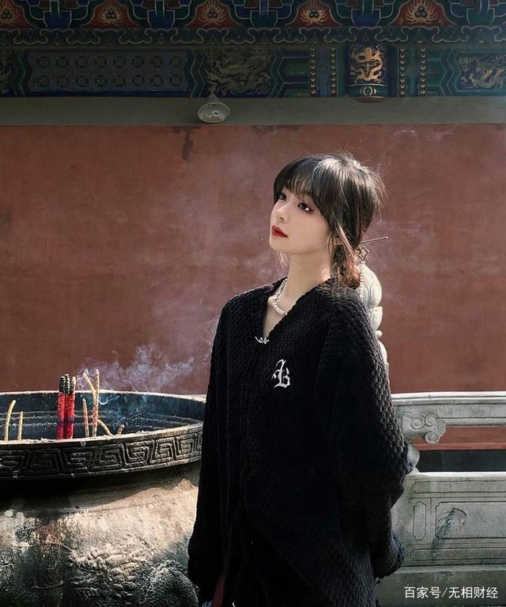

地狱空荡荡，佛媛在人间。

一趟拜佛之旅，能产出几段视频，数十张照片，牌号88888的豪车。

**哎，这些佛媛为什么对面总有个摄像头呢？**

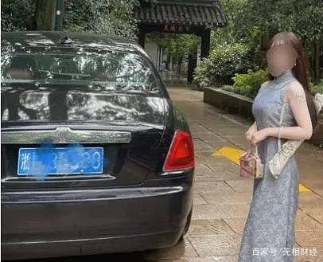

**说白了，还是为了流量，还是为了把自己“卖”个好价钱！**

在她们的分享中，处处透露着高大上，比如定位在北京大学的一场赌场风云。

文案依旧是佛里佛气的：“留三分贪财好色，以防与世俗格格不入。”

真就是赌筹手中过，佛主心中留。

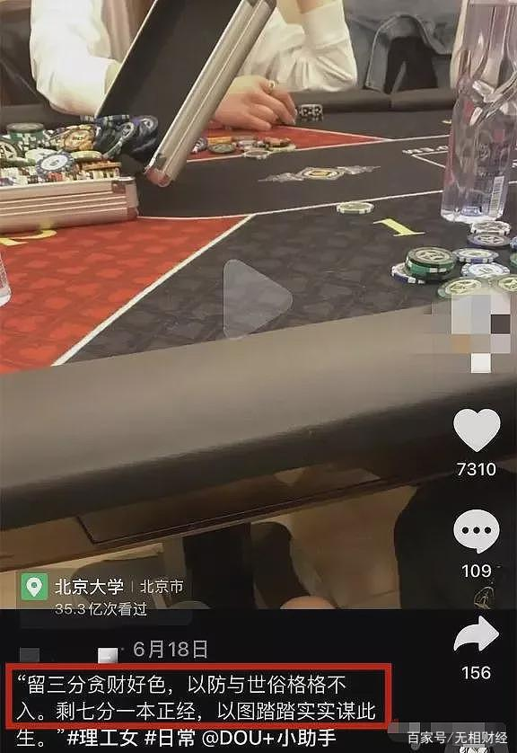

还有的，秀出了爸爸给的支票。

不多，666万而已，主要是讨个吉利，母亲还送了12生肖的金砖呢。

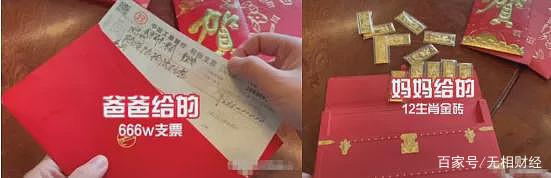

又好看，又有钱，又单身，又心怀佛祖。

这些小姐姐谁不喜欢？

**在某音上，#佛媛#的视频有近60万的播放量，很多“佛媛风”博主的粉丝，都超过了十万，累计点赞量更是数百万。**

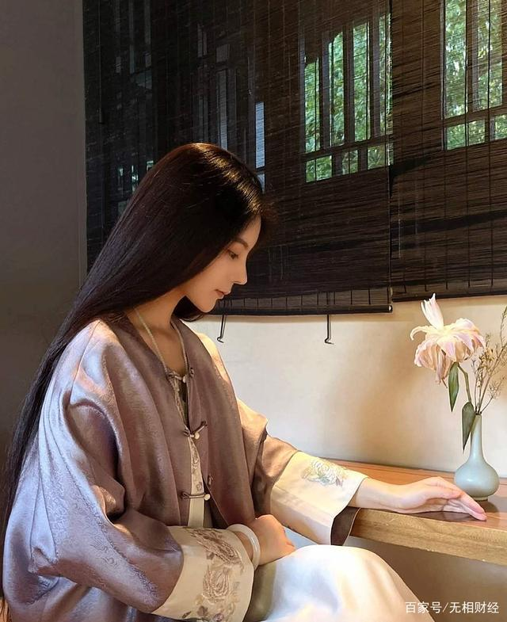

还记得无相君曾经写过的炫富是门好生意吗？

没错，现在升级了。

**不仅仅是炫富了，还炫身材，炫佛法。**

在其他“野名媛”拼单五星级酒店的流水照时，“佛媛”已经另辟蹊径，通过修佛吃斋，不仅规避了平台整治，还实现了弯道超车。

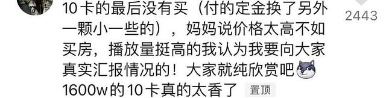

当然，无论是念佛经，还是逛寺庙。

**其核心还是离不开：割韭菜！**

在这些佛媛有了粉丝后，立马开始了后面的套路：

有人带货珠宝，有人卖衣服，有人卖文玩。

还有人卖保健品，搞餐厅推荐……

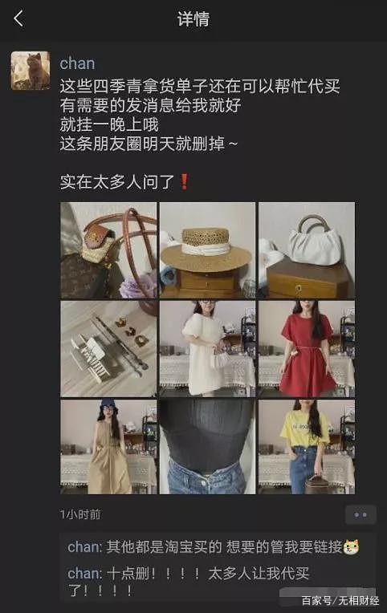

抖音粉丝达36万的网红“chanchan”，一直通过朋友圈带货，货源声称来自浙江杭州四季青批发市场和淘宝。

另一位佛媛“芋不想乖”也开了同名淘宝店，售卖的正是属佛媛标配之一的旗袍，她还会在微信售卖串珠、手链、平安锁等。

**只是一些网友发现，其标价上百元的平安锁，在淘宝等平台上只用50元甚至20元就能买到同款……**

财富的密码是会泄露的。

随着“佛媛”风的兴起，不少网红开始聚集寺庙排队拍照。

**她们把供游客礼佛、参观的清净之所，变成网红取景“打卡”点，一些知名度较高的寺庙都不同程度地被网红们“霸占”。**

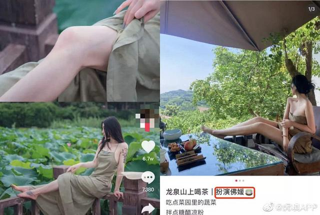

在豪宅里起床喝个早茶，抱着大牌包包打坐修行，抄经焚香叩拜，打玻尿酸塑造佛相，穿开衩袈裟吊带佛衣……

人间真实，何其魔幻？

**可就是这样一群佛媛，却站到了流量的上游。**

这不由让我们想到《西游记》里各色妖孽，她们以为穿了袈裟，就能藏得住自己的狐狸尾巴。

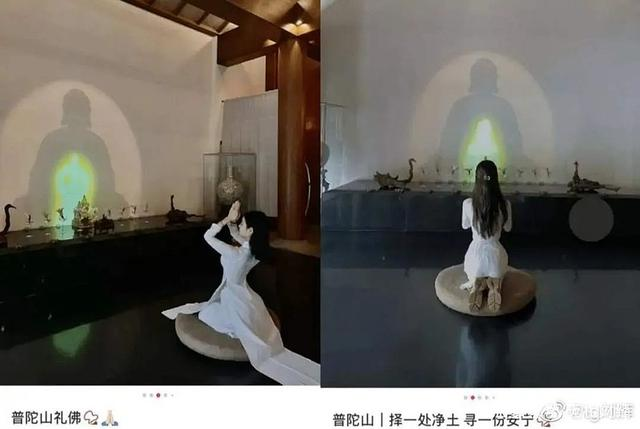

什么佛法、书法。

**她们的心中，只有流量。**

通过亵渎神灵，来满足自己的虚荣心，来收割流量变现，搞不准，还能钓到富二代呢？

**她们的身上，信佛是假的，名牌也是假的，只有骗流量、挣快钱的想法是真的！**

实际上，无论是什么“佛媛”还是“名媛”、“雪媛”。

核心就是那一套玩法。

一个生活体面的人，总是会得到关注和资源，获得更多的崇拜和信任。

所以诈骗犯往往会把自己包装成腰缠万贯、学富五车的精英。

而这些名媛网红，就是利用人嫌贫爱富、好色好食的固有属性，通过制造虚幻的影像，来吸引流量和粉丝。

**从而把这门生意越做越大，也把社会风气越带越歪。**

在此之前，图书馆、美术馆、农村乡野都是他们的主战场。

只不过，这次轮到了寺庙，而下次一定还会有新的变种。

这些佛媛，本质也是为了贪图财色名利，
众生都是趋利避害，也能理解
只不过方法用错了，
&nbsp;
这些名媛只是简单炫耀色相会显得很低俗，
而佛是很高贵的，因为佛有大智慧，大福报，
佛从古至今都是顶级名人，也是超级大网红，无人不知无人不晓，
把自己和佛关联起来，沾点佛光，显得自己也有智慧福报，这无可厚非，
问题是在礼佛学佛的同时，还炫耀色相，炫富，这与佛的教诲背道而驰，就是不懂佛法，在乱搞了。

> 《佛说轮转五道罪福报应经》：
> 人而豪贵。国王长者。
> 从礼佛事三宝中来。

地位高贵，从礼佛敬事三宝中来，
不仅仅是行为上，摆个样子，
更重要的是心里上要真有佛，
&nbsp;
但是这些名媛，心里被财色名利占满了，并没有佛的位置，
礼佛也只是为了拍照炫耀，
所以并不能得到好果报，
瞎忙和一场。
&nbsp;
相反还有副作用，

> 《大乘方广总持经》：
> 以谤法故身及眷属俱堕地狱。

这些名媛假装自己是佛弟子，但是自己对佛法一无所知，
日常行为也与佛的教诲背道而驰，
佛并不认可这些名媛是佛弟子，
谤佛谤法，自己和家亲眷属都会堕地狱，
克夫相就是这么来的，

> 《地藏菩萨本愿经》：
> 若有众生伪作沙门心非沙门。
> 破用常住欺诳白衣。违背戒律种种造恶。
> 如是等辈当堕无间地狱。千万亿劫求出无期。

但是外人不懂佛法的一看，以为这些名媛代表佛教，
以为佛教就如同这些名媛一样下流低俗，
自然会对佛教鄙视，自然也不会学习佛法，断送了慧命，
这比杀人罪还要重，
因为杀人只害一生，
断人慧命，让人永远失去脱离六道轮回，失去离苦得乐的机会，等于害人无数生，
果报是无间地狱，千万亿劫都出不来，
&nbsp;
赚钱道路千千万，最不该的就是用佛法来赚钱，
如果非要赚钱，听佛的，财布施得财富，这才是正道。
&nbsp;
关于穿着，不仅仅在寺院不能衣着暴露，
在任何时候都不能，
因为衣着暴露会引起男人的意淫，造意业，
重则给自己感召好色之徒，甚至招来猥亵强暴，

> 《四十二章经》：
> 佛言。弟子去离吾数千里。意念吾戒必得道。
> 在吾左侧意在邪终不得道。
> 其实在行。近而不行。何益万分耶。

如果真的是佛弟子，应该时时刻刻都把佛放在心上，
言行举止都应该按照佛的标准来执行，
这样即使不在佛身边，也能得到各种好善报，避免各种灾祸，是真正的佛弟子，
&nbsp;
如果不听佛的话，言行举止没有按照佛的标准来执行，依然杀盗淫妄酒、贪嗔痴慢疑，
即使在佛的身边，也会得到各种好恶报，感召各种灾祸。
&nbsp;
就好比养生老师教育学生不要抽烟喝酒，
真的学生，应该时时刻刻都把老师的话放在心上，
言行举止都应该按照老师的标准来执行，真正做到不抽烟喝酒，
这样即使不在老师身边，也能得到健康，避免各种疾病，是真正的好学生，
&nbsp;
如果不听老师的话，言行举止没有按照老师的标准来执行，依然抽烟喝酒，
即使在老师的身边，也会得到肺癌、酒精肝等各种疾病。
