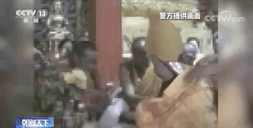
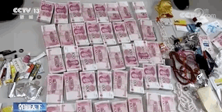

通过层层包装，所谓的“气功大师”王兴夫，摇身一变成了转世活佛“洛桑丹真”。10年里，他非法敛财近2亿元，并强奸猥亵数名女弟子。近日，济南中级人民法院对这起假活佛案作出终审判决。

层层包装 “气功大师”变身“活佛”

在一段名为《洛桑丹真活佛坐床法会纪实》的视频中，“洛桑丹真”活佛于2008年9月5日到9月7日，先后在四川省甘孜州石渠县的蒙格寺、俄若寺等四座寺庙坐床成佛，是被藏传佛教的几位大成就者认证的活佛。

然而，这位所谓的“洛桑丹真”活佛，真名叫作王兴夫，是一位汉族人。20年前，王兴夫有两个对外的身份，一个是济南监狱系统的公职人员，一个是“气功大师”。王兴夫以“气功大师”的名义长期在外开班收徒，根本顾不上监狱系统的本职工作，1997年，济南监狱在无法联系到王兴夫本人的情况下，对他作出开除公职处理。

因为国家打击取缔有害气功等一系列功法，2000年左右，王兴夫放弃办气功班，转而通过佛教居士的身份进行传佛法活动。2008年，王兴夫想尽办法，在四川省甘孜州石渠县俄若寺，拜当地的一位老僧人为师，并在同门师兄弟鲁绒的帮助下，先后伪造了洛桑丹真、降巴洛桑丹真两张藏族的身份证。

△王兴夫（左）与鲁绒（右）

有了假身份，王兴夫又在鲁绒的帮助下举行了所谓的坐床仪式，对外号称洛桑丹真活佛，由此，王兴夫完成了从“气功大师”到“洛桑丹真活佛”的变身。王兴夫还让弟子通过PS技术，把自己包装成端坐莲花台、头顶佛光的形象，还铸造铜像，让弟子们供奉起来。

以活佛身份疯狂敛财近2亿元

对弟子实施精神控制

变成“洛桑丹真活佛”后，王兴夫开始敛财骗色。济南警方调查发现，王兴夫在全国各地有12套房产。在王兴夫的住所里，警方还查获了大量现金、各种银行卡、金条，以及高档奢侈品和名酒。经审计，王兴夫共非法敛财1.98亿元。

据济南警方调查，自王兴夫以“洛桑丹真”活佛名义开展活动以后，在沈阳、北京、济南、成都等地建立起8大核心道场，核心道场下设各级分道场，在全国20多个省、市、自治区发展弟子3000多人，每个弟子每年都要给王兴夫上交供养。

除了收取弟子的供养，王兴夫还编造了名目繁多的收钱项目：皈依“活佛”要收钱，起法名也要收钱。灌顶传法的费用由低到高4个等级，全部修完，要收费5万元以上。从网上购买的100多元一个的景泰蓝花瓶，在王兴夫做完法事后，就变成“龙王宝瓶”，卖给弟子几千元一个。

王兴夫还利用这些钱财投资公司，安排弟子担任法人代表，销售经营佛教用品，通过非法渠道印制法本、光盘，销售给各地弟子，从中获利。

为了控制弟子，王兴夫要求每个弟子在皈依和修炼的时候，必须在制式的“皈依证”“瑜伽士信息卡”上亲笔写下毒誓。如果叛师叛道，甘受五雷轰顶、被蛇咬死、窒息、被车撞死，并且是现世报。他还编造“身加持”“双修”的歪理邪说，对女弟子实施精神控制，进而实施强奸猥亵。

沆瀣一气 鲁绒被判刑

王兴夫能打着“活佛”的旗号在全国各地实施不法行为，离不开四川石渠县俄若寺民管会主任鲁绒的帮助。王兴夫通过鲁绒牵线搭桥，拜鲁绒的师父为师，两人由此建立了密切关系。随后，两人又分别担任俄若寺民管会的正副主任。

警方侦查发现，在王兴夫变身洛桑丹真的过程中，鲁绒跑前跑后，联系当地村干部，打通各地环节，让王兴夫在当地成功办理了两个假身份证。鲁绒还以俄若寺民管会的名义，给王兴夫出具座床凭证。

为了让弟子们相信王兴夫这个假活佛的身份，每次王兴夫带着弟子去俄若寺，鲁绒都会按照活佛的待遇，高规格接待王兴夫。

2016年，网络上有人举报王兴夫是假活佛，有敛财骗色的行为，引发热议。鲁绒此时又以俄若寺民管会的名义发表声明，力挺王兴夫，称王兴夫“从不为己、从不沽名钓誉，是位清净无私的上师”。作为回报，王兴夫前后通过银行卡或者现金的方式，给鲁绒汇款几千万元。

一个假冒活佛敛财骗色，一个给对方提供包装场所从中获益。济南中级人民法院终审判决，王兴夫犯组织利用邪教破坏法律实施罪、非法经营罪、强奸罪、强制猥亵妇女罪，数罪并罚，判处有期徒刑25年。鲁绒犯组织、利用邪教破坏法律实施罪，判处有期徒刑6年。

佛教从古至今都非常火热，所以有不少人打起歪主意，
利用佛法来获得财色名利，

因为现在真正懂佛法的人少，所以这些所谓的大师活佛，随便忽悠下，就把那些不懂佛法的佛教徒忽悠的团团转，
被骗财又骗色，
傻子太多，骗子不够用，

不管你招式多高明，反正骗不了我，
为什么？
首先我们学佛要明白到底是跟谁学，
并不是跟这些大师活佛学，
而是向释迦牟尼佛学习，
即时我们向和尚居士学习，根本都是向释迦牟尼佛学习，
因为和尚居士都必须是要向释迦牟尼佛学习后，在把释迦牟尼佛的本意原封不动的讲出来，不得依照自己的观念随意修改，这是基本要求，

我们判断一个大师僧人活佛到底是不是真的，很简单，
把他的言行举止，拿佛经来对照，看看是否和佛说的一致，
如果一致，说明是真正的大师僧人活佛，
如果不一致，那就是骗子，

现在社会乱的很，假和尚到处都是，真正的佛法已经不再寺院了，
真正的佛法在佛经里，只有佛经才是最靠谱的，

> 《楞严经》：
> 是食肉人纵得心开似三摩地。皆大罗刹。
> 报终必沉生死苦海非佛弟子。

比如我们看到一个和尚吃肉，在做杀盗淫妄酒，绝对是假和尚，
这是佛说的基本戒律，这都做不到，就出来忽悠，着实把人当傻子，
但是偏偏上当的人确实多，傻子真多，

还有包括主动让你捐钱的，都是假的，
只要主动让你捐钱的，不捐就对了，

> 《楞严经》：
> 此诸众生去佛渐远。
> 邪师说法如恒河沙。

因为佛不在世了，有些假和尚就胡编乱造，
自己不懂佛法，想怎么说就怎么说，完全没有按照佛法来，甚至反着来，
这些就是佛说的“邪师”，人数有恒河沙这么多，

比如要求弟子发毒誓，双修的，都是骗子，
这些内容，佛经里根本没有这种说法，纯粹是假和尚自己编的，

> 《楞严经》：
> 我灭度后末法之中。多此魔民炽盛世间。广行贪淫为善知识。
> 令诸众生。落爱见坑失菩提路。
> 汝教世人修三摩地先断心淫。
> 是名如来先佛世尊。第一决定清净明诲。

佛经里明确说明了，修行人必须要断淫欲，
这些假活佛偏偏反着干，
估计这些假活佛佛经都没读过，
不过编谎话，忽悠人的能力确实强，

假和尚假活佛和释迦牟尼佛没有关系，只过不打着释迦牟尼佛的名号骗财骗色，
但是因为很多人不懂佛法，看到假和尚假活佛骗财骗色，会误认为这些就是释迦牟尼佛教出来的弟子，
误认为释迦牟尼佛就这和这些假和尚假活佛一样卑鄙无耻，下流低贱，
于是对佛法失去信心，自然不会学佛，甚至诋毁佛，
最终吃大亏的是这些无知的吃瓜群众，

> 《楞严经》：
> 云何贼人假我衣服。禆贩如来造种种业。
> 皆言佛法却非出家。具戒比丘为小乘道。
> 由是疑误无量众生堕无间狱。

因为这些放弃佛法的人，等同于放弃了离苦得乐的机会，放弃了脱离苦海的机会，
放弃了了解宇宙人生事实真相的机会，

> 《妙法莲华经》：
> 众圣中尊，　　世间之父。　　一切众生，  
> 皆是吾子，　　深着世乐，　　无有慧心。  
> **三界无安，　　犹如火宅，　　众苦充满**，  
> **甚可怖畏。　　常有生老、　　病死忧患**，  
> 如是等火，　　炽然不息。　　如来已离，  
> 三界火宅，　　寂然闲居，　　安处林野。  
> 今此三界，　　皆是我有，　　其中众生，  
> 悉是吾子。　　而今此处，　　多诸患难，  
> 唯我一人，　　能为救护。　　虽复教诏，  
> 而不信受，　　于诸欲染，　　贪着深故。  
> 以是方便，　　为说三乘，　　令诸众生，  
> 知三界苦，　　开示演说，　　出世间道。

就好比一群不懂事的小孩身处火宅，不知道危险，父亲知道危险，
父亲告诉小孩怎么跑出去，
但是其中有些小孩乱说话，误导其他小孩，错失逃命的机会，结果被烧死，
乱说话的小孩就是假和尚，
被误导被烧死的小孩就是被误导众生，
父亲就是释迦牟尼佛，

因为错失佛法，导致很多问题，
因为没学佛，不知道赌博损财，结果负债累累，
因为没学佛，不知道喝酒会得病，结果被病痛折磨，
因为没学佛，不知道财布施得财富，导致辛辛苦苦一辈子，生活还是解放前，
因为没学佛，不知道杀生吃肉得多病短命，导致得癌症等重病，最后人财两空，
因为没学佛，不知道邪淫破坏婚姻家庭，损财废事业，导致夫妻关系破裂，贫穷事业衰败，
因为没学佛，不知道念阿弥陀佛可以脱离六道轮回，结果一直被生老病死折磨，
因为没学佛，... ... 吃了太多苦，失去太多乐，
损失的价值，不仅仅是钱财能衡量的了，

所以这些假和尚，假活佛的罪是非常重的，杀人于无形之中，果报是无间地狱，千万亿劫，求出无期，
无知的吃瓜群众更可怜，看到假和尚假活佛骗人，自己放弃了真正的佛法，放弃了无价之宝，吃大亏，
唉悲哀！

当然无知的吃瓜群众吃大亏，这黑锅也不能全部怪在假和尚假活佛头上，毕竟自己愚痴无知才是主要原因，
为什么？
因为真正有智慧，懂佛法人，是不会被这些表面现象所误导的，
首先我们要明白，学佛到底是学什么？
学佛实际上就是学习释迦牟尼佛发现的，客观存在，永恒不变的事实规律，
比如佛说吃肉喝酒会感召疾病，
邪淫会导致夫妻关系不和睦，经常争吵，
杀人偿命，欠债还钱，
男人好色女人贪财，等等

佛发现的这些规律，不会因为时间、地点、人物改变而改变，
更不会因为假和尚假活佛骗人而改变，

我们思考一下，会不会因为假和尚假活佛骗人，
喝酒就不会伤身体了？
夫妻一方出轨了，夫妻关系就不会被破坏了？
杀人就不用偿命了？
欠债就不用还钱了？
男人就不好色了？
女人就不贪财了？

并不会！

这些规律，并不会因为假和尚假活佛骗人而发生丝毫改变！

所以假和尚假活佛骗人并不会对真正学佛人产生丝毫影响，
我不吃肉喝酒，依然能避免疾病，
我不邪淫，依然不会破坏夫妻关系，
我不杀生依然能不会感召多病短命，
我财布施依然能得财富，
只要按照佛说的来做，该得的利益一分不会少，该避免的灾难一分不会多，
利益是，公修公得，婆修婆得，不修不得，

就好比是学校里的好学生，是向老师学习，
并不是向坏学生学习，
并不会因为有坏学生而放弃自己的学业，
自己好好学习，就能考上好大学，

坏学生不好好学习，最后只能为自己的错误行为买单，

> 《法苑珠林》：
> 三谓邪淫。犯人妇女。
> 或为夫主边人所知。临时得殃。刀杖加刑。首足分离。祸及门族。
> 或为王法。收捕着狱。酷毒掠治。身自当辜。

佛说邪淫，犯人妇女，触犯王法，有牢狱之灾，
假活佛不愧是“好学生”，“听”佛的话，自己乖乖按照因果报应，邪淫强奸吃牢饭，
顺便像大家展示自己的神功，牢底坐穿大法，

王兴夫犯组织利用邪教破坏法律实施罪、非法经营罪、强奸罪、强制猥亵妇女罪，数罪并罚，判处有期徒刑25年。

