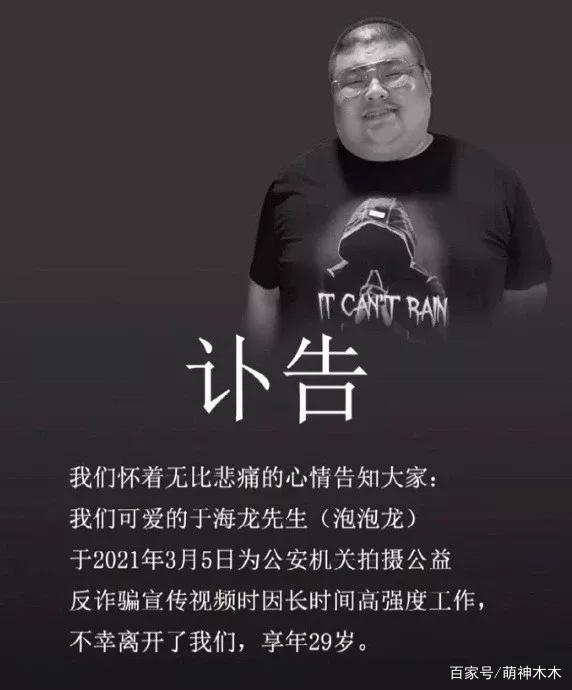
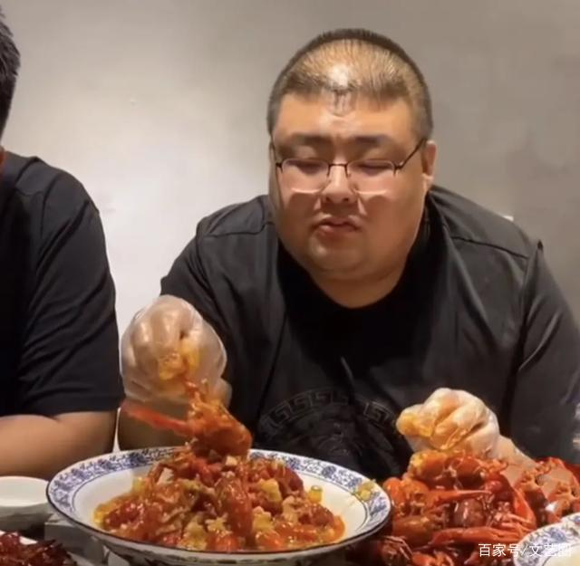
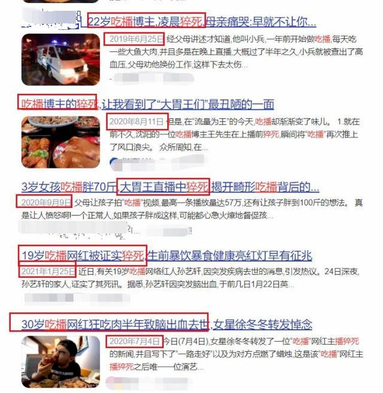

近年直播平台兴起，出现了靠吃饭直播赚钱的行业，简称吃播，
表面上看起来风光，实际上非常危险，
每过一段时间，就会爆出吃播猝死新闻，

不仅仅是吃播，只要是暴饮暴食，都容易得各种各样的病而导致死亡，

> 《佛说佛医经》
> 佛言。有九因缘。命未当尽为横尽。
> 
> 一不应饭为饭。
> 
> 二**为不量饭。（暴饮暴食）**
> 
> 三为不习饭。
> 
> 四为不出生。
> 
> 五为止熟。
> 
> 六为不持戒。
> 
> 七为近恶知识。
> 
> 八为入里不时不如法行。
> 
> 九为可避不避。
> 
> 如是九因缘。人命为横尽。
> 
> 不量饭者。谓不知节度多食过足。是为不量饭。

佛说：暴饮暴食导致横死，
这是佛发现的，客观存在，永恒不变的事实规律，是真理，

这些吃播，没有学佛，不知道这个事实真相，死的有点冤枉，

佛发现的规律，不管你知不知道，相不相信，结果都一样，
并且这些规律是无法改变的，
有些人不明白事实真相，就想着，管他三七二十一，先吃舒服在说，等生病了，去医院治好就行，
等到了医院，才发现，这些病根本治不好，甚至有些人都不能活着进入医院，
为什么？
因为规律不可改，
只要是暴饮暴食就必定得多病短命，
即使再高的医学技术，也无法改变这一个事实规律，[《佛说疾病与健康长寿》](https://www.kancloud.cn/luojiangtao/foshuojiankang)中有详细说明，

所以要想真正健康长寿，还是得乖乖听佛的话，老老实实照着办，
否则交了医药费，钱没了，病还在，
佛才是大医王，保你健康长寿，

人类的医学水平跟佛比差太远了，
如果人类的医学水平真的达到了很高的水平，这些吃播就不会英年早逝了，

相反，如果这些吃播能早点听闻佛法，老老实实照着办，也不至于英年早逝了，

两种结果，截然不同，

可惜人已经走了，没办法学佛了，也没后悔的余地了，
不过能作为反面教材，给大家敲个警钟。

