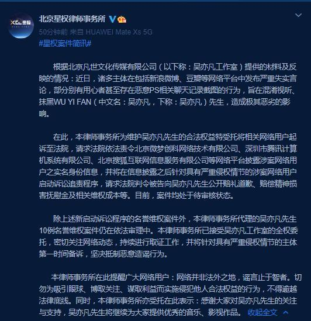
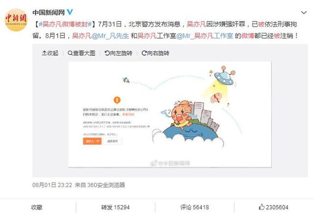

6月2日，一位名为刘美丽的网友在网上为自己的闺蜜都美竹发声，爆出了许多聊天记录怒斥吴亦凡劈腿并且冷暴力都美竹。

7月8日，吴亦凡委托律师正式发函警告都美竹事件中的相关人员！  

7月9日，都美竹称准备报警，要吴亦凡公开道歉；  
7月10日，都美竹接受采访，说绝不撤诉要告到他道歉为止。  

直至7月18日，吴亦凡与都美竹事件在网络的发酵下**爆发**！！先是都美竹爆出超**7成受害人为未成年**！后又爆出受到威胁！之后更是利用微博要求吴亦凡退圈，要不然就会公开很多证据，要吴亦凡24小时开发布会宣布退出娱乐圈，不然她就用手里的东西让他身败名裂。  

也就是当日，央视新闻删除吴亦凡所有歌曲，各大品牌着手解约与吴亦凡的合作！

7月19日，吴亦凡表示都美竹是造谣，吴亦凡工作室也连发多条辟谣帖。  

7月20日，吴亦凡工作室再发文，回应网络对于和都美竹转账问题的争议 ，称都美竹转账聊天截图视频是伪造的。  

**7月21日，数十家官方媒体发声斥责！！！事情愈演愈烈！**  

1：《解放日报》指出，都美竹和吴亦凡事件，已经不仅仅是一个简单的情感纠葛，而是一个严肃的刑事案件！

2：《参考消息》指出，不能让关于明星艺德的话题讨论成为老生常谈，需要对违规甚至涉嫌违法的艺人动真，零容忍！

3：官方媒体《央视网》指出，要提高做明星的门槛，吴亦凡事件不再是娱乐八卦，而是一起影响重大法律案件和公共事件，需要有关部门进行全面调查，解答疑问！4：《共青团中央》指出，触及法律的问题，应该回归法律轨道！

5：《人民法院报》直接点名吴亦凡，并解释了吴亦凡事件中的法律问题！

6：《紫光阁》面对吴亦凡事件，则直截了当地表示行业自律惩戒决不会手软！

7：《中国演出行业协会》指出，道德自律委员会对吴亦凡事件一直保持高度关注！

8：《法治日报》指出，娱乐圈并非法外之地，不管是谁，都是违法的！

9：官方媒体《中国新闻周刊》则表示，艺人一旦出现道德污点，即使不违法，也要承担后果，付出代价！

10：《中国新闻网》对吴亦凡事件进行了理性分析，称如果传闻属实，吴亦凡将受到法律制裁，但如果都美竹爆料系捏造，同样要承担法律责任！

**7月22日，北京警方给出通报！**  

7月23日，在警方通报相关情况之后，路易威登正式宣布终止与吴亦凡的合作。至此，**吴亦凡的17个商务代言全部解约**。  

**7月31日，吴亦凡被朝阳公安分局刑事拘留！！**人民日报评吴亦凡被刑拘：法律面前没有顶流。北京日报评吴亦凡事件：给依法还原真相严惩犯罪一点时间。  

**8月1日，全平台封杀吴亦凡相关账号、音乐下架**。其支持吴亦凡的相关人员同样被封禁账号！  

**8月2日，中国电影家协会、中国音乐家协会、中国电视艺术家协会就吴亦凡事件发声**  

**至此吴亦凡的娱乐圈生涯结束！**

来自中国电视艺术协会

来自中国电影协会

来自中国音乐协会

呈现在公众面前的是一个罔顾法纪、恣意妄为、金钱至上、随心所欲的“明星”。作为文艺工作者，以艺术作品弘扬中国文化的基本职业作用无从谈起；作为公众人物，传递核心价值观的社会职责置若罔闻；作为拥有庞大粉丝群体的“顶流”，触犯法律底线，造成极其恶劣、难以挽回的社会影响，行业难容。目前吴亦凡影视、音乐、综艺等相关作品均已下架，其本人也将接受法律制裁。演艺圈是显性“名利场”，容易让人迷失。一些人逐渐飘飘然，忘了本分，忘了责任。自以为有颜值、有粉丝，就可以没有敬业精神，没有职业道德；自以为有卖点，有关注，就可以没营养、没艺术追求；自以为有资源、有流量，就可以没人品、没底线。殊不知，德不配位的明星如同空中泡沫，飞得再高，膨胀再大，也终会破灭，任性妄为终会脱轨而出。“脱轨”必然要付出代价。

**8月16日，北京市朝阳区人民检察院对涉嫌强奸的犯罪嫌疑人吴亦凡批准逮捕！**  

同日，**爱奇艺、腾讯、优酷三大网络视频下架吴亦凡相关视频与影视！**网易云音乐和 QQ 音乐、酷狗音乐、酷我音乐、Apple Music 中国区下架吴亦凡的相关歌曲，早前，吴亦凡抖音等社交媒体账号均被封禁。  

来自爱奇艺视频

直至今日，都美竹发言感谢警方与粉丝。  
  
就这长达一个月之久的吴亦凡与都美竹事件彻底告一段落了，就小编看来正义可能会迟到，但是不会缺席！不信抬头看，苍天饶过谁？
&nbsp;
一、作为一名中国人，我就想问问，吴亦凡一个加拿大国籍的明星？还作为国内的顶流明星，你不在你的国家为所欲为，来中国捞金还不老实，祸祸我们国内的女性、
&nbsp;
二、你如果只是寻花问柳，那仅仅是道德败坏，只能说是没有道德底线，可能只是遭受封杀！但是你对未成年下手，或是强迫女性，违反其意志！那你就是犯法，去触碰中国的法律红线！真当你是加拿大国籍，就可以在国内为所欲为了？
&nbsp;
三、你真是吃着粉丝的钱还坑粉丝！可悲的是一群不明所以的粉丝还在网络上叫嚣着要救你,真是愚昧！
&nbsp;
愿小伙伴们文明吃瓜，保持理性，就算追星，也要做一个清醒的粉丝！

最后科普一下，**一般司法流程是，传唤——立案——拘留——批捕——判刑。**

既然警方已经对其刑事拘留了，检察院也批捕了，就代表有十足的证据证明他确实是**强奸**！下面就等着被公诉然后判刑就好了。

> 《四十二章经》
> 佛言。爱欲莫甚于色。
> 色之为欲。其大无外。

佛说人最重的欲望是色欲，
吴亦凡既然是人，就得听得“听”佛的话，
在色欲的驱使下，物色女性，做点不可描述的事，

> 《分别善恶报应经》：
> 复次饮酒三十六过。其过云何。
> 十九亲近恶友。
> 二十三淫欲炽盛。
> 三十一违犯过非。
> 三十四身心散乱。
> 三十五作恶放逸。

吴亦凡先按照佛法惯例，酒壮色胆，顺便把女性灌醉，方便办事，
但是吴亦凡失算了，

> 《菩萨诃色欲法经》：
> 女色者。世间之衰祸。凡夫遭之无厄不至。
> ... ...
> 女人之相。其言如蜜。而其心如毒。
> 譬如停渊澄镜。而蛟龙居之。
> 金山宝窟。而师子处之。
> 当知此害不可近。

高端的猎人往往喜欢以猎物的身份出现，
吴亦凡以为自己是猎人，实际上是猎物，
吴亦凡看到美女，以为是宝藏，实际上是诱饵，
犹如只看到金山，没看到狮子，
&nbsp;
吴亦凡也不想想，这些女人，凭什么给他祸祸，其他人没分，

> 《正法念处经》云：
> 女人性如风　　其心不停息　
> 若见大财富　　心则生爱乐　

女人看到富豪，心里就像开了花一样，更何况吴亦凡长得又帅，名气又大，
好不容易掉到这条肥鱼，还不赶紧投怀送抱，

> 《大般涅槃经》云： 
> 如蚊子尿不能令此大地润洽，其女人者淫欲难满亦复如是。

这些女人平时看起来很矜持，实际上淫欲难满，
遇到同样饥渴的吴亦凡，干柴遇烈火，管他三七二十一，先烧了在说，

> 《楞严经》
> 十方一切如来。色目行淫同名欲火。
> 菩萨见欲如避火坑。

吴亦凡以为烧完后，只剩一把灰，吹一吹就了事，
时候就没管了，
直接换下一个目标，继续激情燃烧，
没想到故事才刚刚开始，邪淫的种子已经发芽，
没注意到自己已经引火上身，
&nbsp;
都美竹认为是真爱，需要天长地久，
吴亦凡觉得都美竹用爱情来玷污纯洁的炮友关系，
双方三观不一致，于是大战一触即发，
&nbsp;
被甩后都美竹在网上爆料吴亦凡，惊呆吃瓜群众，
以为他拿的是金牌，没想到是淫牌。
&nbsp;
事后都美竹吐槽吴亦凡像牙签一样细，让其改名叫“吴签”
签里之行，死于竹下
&nbsp;
最后吴亦凡妈妈不堪忍受骚扰，选择报警，
结果警方发现吴亦凡性侵录像，
估计是大明星当习惯了，就连床上办事都离不开摄像头，

> 《法苑珠林》：
> 三谓邪淫。犯人妇女。
> 或为夫主边人所知。临时得殃。刀杖加刑。首足分离。祸及门族。
> 或为王法。收捕着狱。酷毒掠治。身自当辜。

然后就送进牢房，踩缝纫机，
亦失足成签古恨，
伙食从《大碗宽面》（吴亦凡歌名），变成大碗牢饭，
&nbsp;
一曲铁窗泪，送给吴顶流。
&nbsp;
吴丝竹之乱耳，吴案牍之牢行，斯是陋室，惟吴得刑
&nbsp;
辛辛苦苦几十年，炮后不如解放前
&nbsp;
事件爆出来后，各大吴亦凡代言品牌纷纷宣布节约，
电影电视剧歌曲也统统下架，面临巨额赔偿，

> 《佛说善生子经》云： 
> 淫邪有六变当知。何谓六。
> 不自护身。
> 不护妻子。
> 不护家属。
> 以疑生恶。怨家得便。**众苦所围**。
> 已有斯恶则**废事业**。
> **未致之财不获。既获者消。宿储耗尽**。

吴亦凡损失了两种财，
一是已经赚到手的钱财，
吴亦凡因为乱打炮，在女人身上了不少钱，事后还面临上亿元巨额赔偿，
这就是佛说的：“**既获者消。宿储耗尽**”
&nbsp;
二是未来本该赚到的钱，赚不到了，
如果没有性侵事件，吴亦凡可以继续赚取品牌代言费、拍电影电视剧赚钱、出歌赚钱、开演唱会赚门票费等等，
但是吴亦凡性侵事件出现后，这些未来可以赚到的钱，赚不到了！
这就是佛说的：“**未致之财不获**”
&nbsp;
色字头上一把刀，一刀砍掉N个亿
&nbsp;
明星事业从此就废掉了，改行踩缝纫机了，
这就是佛说的：“已有斯恶则**废事业**”
&nbsp;
吴亦凡之前名气大，没人敢得罪他，
出事后，之前炮友也跳出来举证他，
差点被他祸祸的女性也出来吐槽他，
这就是佛说的：“怨家得便”，逮着机会好报仇，
&nbsp;
这个大瓜直接冲上热搜，比之前还火，
这就是佛说的：“恶名流布”，
&nbsp;
从顶流到阶下囚，有多痛苦大家应该都懂的，
这就是佛说的：“**众苦所围**”，被各种痛苦包围，
这苦，够吃一辈子了，
&nbsp;
其实吴亦凡是有机会避免这次灾难的，
吴亦凡在电影《西游伏妖篇》中演绎唐僧，
从东土大唐去往西天取佛经，
&nbsp;
为了取佛经，要经历九九八十一难，不惜冒着被妖怪吃掉的风险，
命可以不要，佛经必须要，
佛经比命更重要，
&nbsp;
佛经取来干啥用的？
书嘛，当然是用来看的，
&nbsp;
佛把保佑人的方法，都写在了佛经里，
佛经里明确写了邪淫有各种因果报应，
只可惜吴亦凡只取了佛经，没打开看，更没听佛的话，照着做，
忽悠佛祖，结果把自己坑了，
&nbsp;
不过吴亦凡演的也没毛病，
完全按照佛经剧本来走，
&nbsp;
佛说邪淫的果报有：
1，未致之财不获。既获者消。宿储耗尽（损财）、
2，废事业、
3，恶名流布、
4，怨家得便、
5，众苦所围
6，或为王法。收捕着狱。（吃牢饭）
&nbsp;
吴亦凡都全部做到了，
不愧是佛的“好弟子”，
拿自己的一辈子，为我们表演了反面教材。

