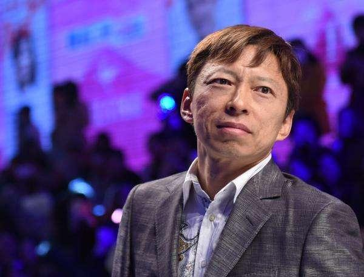

张朝阳17岁考上清华，22岁保送麻省理工，31岁创立爱特信（“搜狐”前身），36岁公司美股上市实现财务自由，身边美女环绕。张朝阳的人生可谓花团锦簇、一帆风顺。
&nbsp;
然而就在张朝阳夜夜笙歌之时，新浪、小米、BAT火速崛起，搜狐的光芒逐渐黯淡。巨大的落差之下，张朝阳陷入抑郁：“一下子就觉得脑子不对劲，像是被击穿了一样。”
&nbsp;
**张朝阳之所以患抑郁症，根本主要原因是苦吃太多了，**
&nbsp;
张朝阳：我有钱可以想买什么就买，但是，我居然感觉这么痛苦！
&nbsp;
张朝阳：“我真的什么都有了，但我居然这么痛苦”，“所谓荣华富贵，那不是人过的日子！”
&nbsp;
张朝阳是大众中的成功人士，在这种情况下，张朝阳居然说自己很痛苦，
不知妻美刘强东，有钱痛苦张朝阳，
在大众看来，表示很不能理解，
部分网友调侃：把钱都给我吧，让我来承受痛苦！
&nbsp;
其实大家误会张朝阳了，他是实话实话，
因为我是学佛的，并且有和他一样的经历，所以我一看就知道他确实很痛苦，
而且就算他不说，我都知道他很痛苦，这就是佛法的高明之处，
&nbsp;
> 《大般涅槃经》
> 智者复观世间有法。所谓舍宅衣服饮食卧具医药。香花璎珞种种伎乐财物宝货。如是等事皆为离苦。而是等物体即是苦。云何以苦欲离于苦。善男子。智者如是观已。于世间物不生爱乐而作乐想。

首先张朝阳有一个错误的观念，财富=幸福，
佛说人生一切皆苦，包括财富，
实际上财富并不能带来幸福，财富的真正作用是解决部分痛苦，
比如没饭吃，饥饿苦，没衣服穿寒冷苦，钱财的作用是解决这些痛苦，
财富让这些痛苦暂停了，误认为是快乐，实际上没有快乐，只是痛苦暂停了，
&nbsp;
就好比口渴了很痛苦，喝水就感觉很快乐，这种快乐是假的，是口渴的痛苦暂停了，误认为是快乐，
在不口渴的时候喝水，并不会感到快乐，
&nbsp;
财富也是同样的道理，当财富自由后，缺衣少食的痛苦都暂停后，在赚更多的钱，并不能帮助张朝阳解决痛苦了，
所以他并不会因为赚到更多的钱感到快乐，
所以赚第一桶金感觉最快乐，后面就会大打折扣，
&nbsp;
财富能解决的痛苦很有限，人生有很多痛苦，财富无法解决，比如生老病死苦，要想解决这些痛苦，必要有大智慧，光有钱不行，
&nbsp;
> 《法苑珠林》
> 人生在世常有无量众苦切身。今粗为汝等略说八苦。何谓八苦。
> &nbsp;
> 一生苦。
> 二老苦。
> 三病苦。
> 四死苦。
> 五恩爱别苦。
> 六所求不得苦。
> 七怨憎会苦。
> 八忧悲苦。
> 是为八苦也。

张朝阳虽然很有钱，但是无法摆脱生苦、老苦、病苦、死苦、爱别离苦、怨憎会苦、求不得苦、五阴炽盛苦。
这些苦众生平等，无关贫富，
&nbsp;
但是如果造恶业了，会加剧这些苦，
&nbsp;
钱本来是个好东西，佛却说是苦，是因为世人没有智慧，钱多了就会造业，感受苦报，
&nbsp;
自己也坦诚早年成功赚大钱后沉迷夜店，夜夜笙歌！身边后很多美女围绕，
他手下的高管戏言“他女朋友很多，但他是个好人！
&nbsp;
> 《佛说善生子经》云： 
> 淫邪有六变当知。何谓六。
> 不自护身。
> 不护妻子。
> 不护家属。
> 以疑生恶。怨家得便。**众苦所围**。
> 已有斯恶则废事业。
> 未致之财不获。既获者消。宿储耗尽。

张朝阳身边女人不断，这在佛看来属于邪淫，自然有因果报应，
果报之一：**众苦所围**，会被很多痛苦包围，
&nbsp;
> 《大宝积经》：
> **当知妇人是众苦本**。是障碍本。是杀害本。是系缚本。是忧愁本。是怨对本。是生盲本。
> 当知妇人灭圣慧眼。
> 当知妇人。如热铁花。散布于地。足蹈其上。
> 当知妇人于诸邪性流布增长。

因为女色是众多痛苦的根本原因，是大苦因，这种苦非常隐蔽，没有大智慧看不出来，当事人能感受到，普通人看不出来，
并且这种痛苦非常剧烈且持久，痛苦包含精神痛苦和肉体痛苦，
邪淫带来的痛苦，远远的超出了普通人所认知的痛苦，
大部分人认为，农民脸朝黄土背朝天是苦，生活清贫是苦，实际上邪淫的苦远远的超过了这些苦，

> 《楞严经》：
> 是故十方一切如来。色目行淫同名欲火。菩萨见欲如避火坑。

普通的苦好比是普通的火烧，邪淫的苦好比是西游记里面的三昧真火烧，
感觉就像是欲火同时灼烧肉体和灵魂，这种苦非常深，无法言说，佛说是大苦，
&nbsp;
仅仅只是动下淫念，就会产生苦，实际造作苦会更重，
邪淫本身会产生精神上的苦，在加上邪淫导致健康、事业、面相、智慧、人际关系等衰败，内外结合，相互加成促进，会大大的加剧痛苦，
&nbsp;
张朝阳主要就是吃了邪淫的苦，在加上其他杂七杂八的苦，一起压垮了身体和精神，
&nbsp;
> 《佛说优填王经》：
> 佛言。具听男子有四恶急所。当知世有淫夫。恒想睹女思闻妖声。远舍正法疑真信邪。淫网所綶没在盲冥。为欲所使如奴畏主。贪乐女色不觉九孔恶露之臭秽。浑沌欲中。如猪处溷不觉其臭。快以为安不计后当在无泽之狱受痛无极。注心在淫啖其涕唾玩其脓血。珍之如玉甘之如蜜。故曰欲态之士此为一恶态也。

首先人身不净，女人的身体不干净，在亲密接触时会摄入对方身上不干净的物质和病菌，
张朝阳这些东西接触多了，自己身体会被污染，会得病，病苦是大苦，
&nbsp;
> 《首楞严经》云： 
> 多淫众生，淫习交接，染心会合研磨不休，精血耗散积而成火。 
> 火旺水落石出竭，现生多感神志委靡，畏风寒炎热，多病短命。

淫欲会大量消耗精气神，导致神志委靡，精神衰弱，多病短命，
精神上会导致强迫症、社交恐惧症、焦虑症、抑郁症、神经症；
身体上会导致多种疾病和症状，[《佛说疾病与健康长寿》](https://www.kancloud.cn/luojiangtao/foshuojiankang)中有详细说明，
&nbsp;
张朝阳说过自己患抑郁症，邪淫“功不可没”，可惜他自己没学佛，不知道，
除了抑郁症，其他病症张朝阳虽然没说，但是邪淫得多病短命这个规律是佛发现的，客观存在，永恒不变的真理，
由此推断，张朝阳身体一定有不少的病症，这也是张朝阳痛苦的原因之一，
这些因为邪淫导致的病症只有戒除邪淫才能痊愈，除此之外别无他法，其他方法都是治标不治本，
&nbsp;
这些精神和肉体上病苦，会长期持久的折磨张朝阳，
因为张朝阳没学佛，不知道女色是大苦，所以也就不知道戒，一直反复邪淫，不断累积苦因，
因为苦因累积太多了，所以张朝阳感受到的痛苦，不是一般人所能体会的，
&nbsp;
邪淫果报之二：废事业，
就在张朝阳夜夜笙歌之时，新浪、小米、BAT火速崛起，搜狐的光芒逐渐黯淡。巨大的落差之下，张朝阳陷入抑郁：一下子就觉得脑子不对劲，像是被击穿了一样。
&nbsp;
邪淫会大量消耗精气神和时间，导致事业衰败，
张朝阳放纵自己后，事业就开始走下坡路，
对于事业心很强的他来说，这是一个不小的打击，
&nbsp;
因为邪淫导致事业衰败，本来未来能赚很多钱的，但是事业衰败了，赚不了了，甚至赔本了，
这就是佛说的：**未致之财不获**。损未来的财，
&nbsp;
在玩女人的过程中，张朝阳也肯定花了不少钱，这点他虽然没说，也能猜到，
还有因为身体病症花费的医药费，因为抑郁症影响工作，
甚至于女人的封口费，分手费等，这些都是一笔不小的开销，
这就是佛说的：**既获者消。宿储耗尽**。损现有的财，
&nbsp;
钱财的流失损耗，是一个痛苦的过程，
好在张朝阳财富巨大，换作一般人真消耗不起，
&nbsp;
> 《大方广佛华严经》：
> 邪淫之罪。亦令众生。堕三恶道。若生人中。得二种果报。
> 
> 一者妇不贞洁。
> 
> 二者得不随意眷属。

邪淫障碍姻缘，导致张朝阳至今未婚，感受求不得苦，
估计他父母对他有意见，导致家庭关系不和睦，感受怨憎会苦，
邪淫还会影响人际关系，这些都是苦，
&nbsp;

&nbsp;
分析下张朝阳面相，我客观实事求是的分析，并无恶意，
因为相由心生，面相是内心状态的体现，通过面相能看到内心状态，
&nbsp;
张朝阳的面相整体并不算好，第一眼看上去，仿佛带着痛苦面具，这也是抑郁症患者的表现之一，
两眼无神，眉毛稍许脱落，皮肤暗沉没有光泽，有一些痘坑，不平整，这些和邪淫有关系，
脸上的皮肤似乎有点拖不住，有点下坠，这是精气神不足的表现，
这也侧面反映了张朝阳五脏六腑不好，
五脏六腑好的人，看起来光彩熠熠，比如婴儿，
&nbsp;
不过张朝阳骨相好，标准瓜子脸，没有歪瓜裂枣，得益于小时候邪淫少，成年后才开始放纵，
&nbsp;
一个人过的幸福不幸福，会直接表现在面相上，一眼就能看出来，张朝阳确实痛苦，
张朝阳今生大富，源自于前世布施，
张朝阳学历很高，智商很高，但是智慧有限，不知道女色是大苦，不知道人生众苦如何解脱，
这也是因为他父母不懂佛法，没有教育他导致的，国家义务教育也没有教佛法，导致张朝阳吃了不少苦，
&nbsp;
女色邪淫是导致张朝阳吃苦的主要原因，因为邪淫的果报多，来得又快，

> 《佛说八大人觉经》：
> 欲为苦，生死疲劳，从贪欲起；少欲无为，身心自在。

&nbsp;
除此之外，贪嗔痴慢疑，杀盗淫妄酒，吃喝嫖赌抽都是苦因，这些苦因需要有大智慧才能发现，
比如贪欲太重了，就很苦，想赚大钱，出名，拼命努力过程苦，得不到苦，失去了也苦，
&nbsp;
张朝阳如果没有遇到佛法，这些痛苦注定无法摆脱。
&nbsp;
张朝阳为了治疗抑郁症寻找了各种各样的方法，包括大脑科学、心理学，这些都只是在表面现象上下功夫，
> 《法苑珠林》：
> 不先学小乘后学大乘者非佛弟子

也尝试过佛法，但是我估计是学偏了，比如一上来就尝试禅修或者大乘经典入手，不从最基本的五戒十善、因果报应入手是行不通的，
就好比一个小孩一上来就学高等数学，不从最基本的加减乘除入手是行不通的，
&nbsp;
实际张朝阳治疗抑郁症过程中，使用的是比较笨的方法，
先造一大堆苦因，然后慢慢吃，旧苦还没吃完，又造新苦，苦消化的比较慢，
所以张朝阳的抑郁症康复比较慢，
这样做也很危险，如果苦太多了，扛不住，就会自杀，比如张国荣，
&nbsp;
在比如戒邪淫，张朝阳并不是通过学佛来戒邪淫断除苦因，
而是随着年龄增长，荷尔蒙消退，身体机能退化，“被迫”戒邪淫，
这是身体自救功能，但是这就导致恢复比较慢，
&nbsp;
张朝阳要想治好抑郁症，最好的办法就是依靠佛法，断除苦因，这也是最快速，最根本的方法，
还有用学佛的快乐来冲洗痛苦，能加速抑郁症好转，
佛法法喜充满的快乐，是人世间最大的快乐，
方东美：学佛是人生最高的享受。

