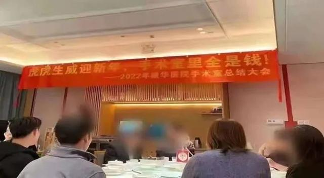

2022年1月26日，一张照片在网上流传。图片显示，在东莞康华医院手术室举行的2022年终总结大会上，悬挂着一条横幅，上面写着“虎虎生威迎新年，手术室里全是钱”。照片传开后，舆论一片哗然，许多网友都对这家医院的医德医风产生了强烈的怀疑。
&nbsp;

&nbsp;
网上传播的事件照片
&nbsp;
根据事后涉事医院的回应，这次聚餐是手术室部分人员自发组织的，“手术室里全是钱”的说法是为了营造轻松的用餐氛围。然而，不论这番话有怎样的语境背景，本质上都是对患者的不尊重。一场场人命关天的手术，在某些医护人员眼里竟是“摇钱树”，这和人们眼中“有时治愈，常常帮助，总是安慰”的医护形象相去甚远。
&nbsp;
医护人员也是普通人，也要养家糊口。君子爱财，取之有道，在治病救人的过程中，医生根据手术的难易程度、技术含量获得劳动报酬是理所应当的事，谈钱并不丢人，但医生职业之所以受到社会尊崇，正是因为医生面对的是一条条鲜活的生命。做手术不是在流水线上组装零部件，不管是出于人性本能还是职业道德，医护人员在面对病患时都应恪守医德，尽最大努力给病人送去温暖。如果患者在医生眼里成了赚钱工具，人们又怎能相信这样的医生真会为了自己着想？

医院回应 图片来源：东莞康华医院
&nbsp;
“手术室里全是钱”之所以刺痛人们的神经，也和社会上存在的某些医疗乱象有关。个别医院一心牟利，想方设法从病人身上榨取金钱，严重抹黑了医护人员的公众形象。2012年，广东一医院曾挂条幅“祝贺”住院病人超4万人次，被公众认为太过冷漠。还有一些医院为了增加收入不顾医学规律，乱看病、乱治疗，自己赚得盆满钵满，却加重了病人的负担。
&nbsp;
这起事件中的康华医院，是广东一所民营三甲医院。其实，许多民营医院都是正规经营、尽心竭力为病人服务的，与公立医院并无本质不同，甚至可能经营得更好。但是，部分民营医院“傍协和”、虚假诊疗、把医生变成推销员、忽悠病人的做法，给民众留下了严重的心理阴影，也给民营医院贴上了诸多负面标签，造成了行业性的“信任危机”。
&nbsp;
目前，康华医院已就此事向社会道歉，对相关责任人进行批评教育。“手术室里全是钱”这句话让人听着心寒，院方还需扪心自问，是否对得起“医者仁心”。患者对一所医院乃至整个医护人员群体的印象，必然从看得见、摸得着的医疗服务中产生。如何给患者留下良好印象，加深医患互信，是每个医疗从业者都需要思考的问题。
&nbsp;
医院虽然口上道歉了，这种现象以后可能看不到了，
但是这种行为无法杜绝，并且会一直延续，
因为贪财是刻在人骨子里的人性，
&nbsp;
作为老百姓，只要躺在手术台上了，就是待宰的羔羊，
宰的不仅仅是身体，还有钱包，
辛辛苦苦几十年，一病回到解放前，
为什么会有这种现象？
&nbsp;
[《佛说疾病与健康长寿》](https://7qrbxke2v5.k.topthink.com/@ogr85b1re1/mulu.html)中详细说明了，
杀盗淫妄酒这些恶业会导致各种疾病，
只要得病了，就得乖乖掏医药费，
这是杀生吃肉、邪淫等导致多病短命，进而损财的因果规律，
公式：杀盗淫妄酒=>多病短命=>损财交医药费

> 《优婆塞戒经》云： 
> 一切众生因杀生故。现在获得恶色恶力恶名短命。财物秏减眷属分离。

反之，不造这些恶业就不会亏这些钱，不亏就是赚，
> 《入楞伽经》云： 
> 智慧及富贵， 斯由不食肉。

这是客观存在的事实规律，只不过人的智慧低看不出来，佛看出来了而已，
这个规律不管你知不知道，相不相信都存在，
&nbsp;
不知道这个规律的人亏了健康有亏了钱财，还是得乖乖交医药费，
更惨的是，即使掏了钱，病还是治不好，造孽的很！
最后治不好把命丢掉了，人没了，钱还在，悲哀！
&nbsp;
我们去责备这些向钱看的医院医生也没用，因为他们也是在顺应佛发现的这个自然规律，
配合这个规律，“帮助”那些造恶业的人完成得病后损财的果报，
&nbsp;
佛法能帮你防病防药防医院，保佑你健康平安，钱包平安，
&nbsp;
所以现在正在造杀盗淫妄酒这些恶业的人，就是在辛辛苦苦的帮医院赚钱，
更可怜的是，自己还不知道这个事实，
等到因果报应现前了，才不得不面对事实，感叹命苦，
&nbsp;
对于能看到我写的这篇文章的人，你真的非常幸运，你听闻到佛法，能改变你两大命运，
1，健康运，不会在因为这些恶业而感召各种病，不用忍受病痛的折磨，人生在世健康最重要。
2，财运，辛辛苦苦赚的钱，可以自己享受，不用让医院帮你享受了，小病节约几千元，大病节约几百万，你自己算算节约了多少钱！
&nbsp;
把这篇文章转发给你身边的人，一个小动作，就能改变他们的命运。

