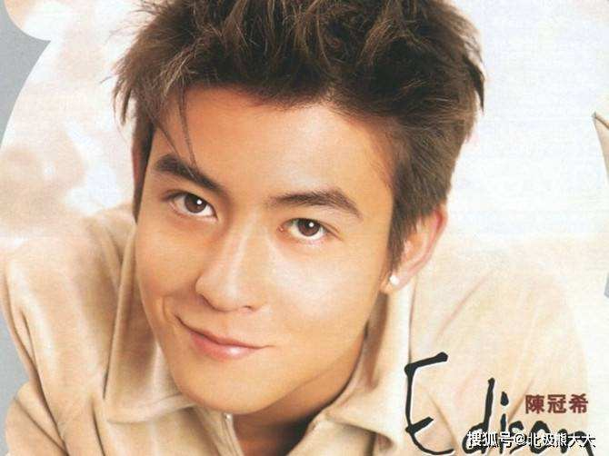
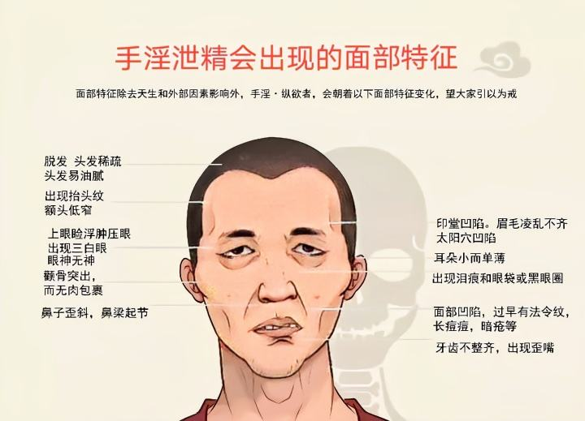

1980年出生的陈冠希年轻的时候非常帅，千万少女为之着迷，
&nbsp;
2008年，陈冠希电脑坏了，拿去修，
没过几天，一个平平无奇的晚上，一位名叫“奇拿”的网友，在天涯社区晒出陈冠希和其他女星的私密照片。
奇拿贴出来的照片，内容豪迈大胆、不堪入目，更是涉及当红明星张柏芝、钟欣潼等人。
这就是当年陈冠希艳照门事件，
&nbsp;
搞的谢霆锋和张柏芝离婚，
&nbsp;

&nbsp;
此后多次爆出与多个女人有染，
&nbsp;
陈冠希也因此跌下神坛，慢慢消失在大众视线，
&nbsp;

&nbsp;
十几年后，被网友发现，陈冠希长的越来越像赵本山，
这颜值下滑的也太快了，
&nbsp;

后来开直播，差点认不出来了，
这么多年过去了，除了痞子气还在，颜值早已不在，
皮肤暗沉，有些色斑，两眼无神，皮肤下坠，精气神明显大不如前，
笑容猥琐，
&nbsp;
> 《分别善恶报应经》：
> 复云何业获报丑陋。有十种业。何等为十。
> 
> 一恒起瞋忿。
> 
> 二恣纵慢心。
> 
> 三不孝父母。
> 
> 四恒恣贪痴。
> 
> 五毁谤圣贤。
> 
> 六侵夺𣣋逼。
> 
> 七盗佛光明。
> 
> 八戏弄他丑。
> 
> 九坏佛光明。
> 
> 十**行非梵行**。
> 
> 如是十种获报丑陋。
> &nbsp;
> 复云何业获报端严。有十种业。云何十业。
> 
> 一修慈忍。
> 
> 二惠施佛塔。
> 
> 三涂扫塔寺。
> 
> 四修严精舍。
> 
> 五庄严佛像。
> 
> 六孝养父母。
> 
> 七信重圣贤。
> 
> 八谦卑离慢。
> 
> 九**梵行无缺**。
> 
> 十远离损害。
> 
> 如是十种获报端严。

梵行：不淫欲，
佛说淫欲使人变丑，不淫欲则使人端严好看，
&nbsp;
陈冠希颜值大幅下滑，越长越丑，完全在佛的预料之中，
主要原因就是纵欲过度，邪淫导致的，
&nbsp;
每一次邪淫都会使人变丑，只不过每一次变化不大，长时间的积累就会导致巨大的变化，
颜值就和钱财一样，消耗一点少一点，消耗多了，就会明显变丑/变穷，
只不过细微的变化，普通人看不出来，
&nbsp;
就和吸烟有害健康一样，每吸一口烟都有害健康，并不是说非要吸几十年烟得肺癌了才叫有害健康，
所以想变好看的小伙伴要注重这些细节，
佛发现的这个规律，对于男女都一样哦，
&nbsp;
邪淫属于恶心、恶念、恶行，自然会显现在脸上，使人变丑，
&nbsp;
其中的规律是相由心生，这是佛发现的客观存在，永恒不变的真理，
即使陈冠希没学佛，不知道，不相信这个规律，依然无法逃脱佛发现的真理，
&nbsp;
邪淫变丑这个事其实很常见，有经验的一眼就能看出来，
戒色吧里面，这种例子多得很，

&nbsp;
> 《佛说善生子经》云： 
> 淫邪有六变当知。何谓六。
>**不自护身**。
>**不护妻子**。
> 不护家属。
> 以疑生恶。**怨家得便**。**众苦所围**。
> 已有斯恶则**废事业**。
> **未致之财不获。既获者消。宿储耗尽**。

陈冠希除了变丑，还有其他果报，
以当时陈冠希的名气，随便拍个电视剧，代言个广告赚几千万没问题，
结果在最巅峰时期，因为艳照门事件退出娱乐圈，导致这些未来本来能得到的收入得不到了，
这就是佛说的，**未致之财不获**，
&nbsp;
已经赚到的钱，还要拿去赔偿，因为艳照门事件，欠了两千万，
这就是佛说的，**既获者消。宿储耗尽**，
&nbsp;
陈冠希年轻的时候犯邪淫，可能会有人说，恶人没恶报，
不是不报时候未到，
等一段时间，就会很明显的显现出来，
&nbsp;
再者，如果没学佛，即使报应出现了，也看不出来，
&nbsp;
陈冠希也算上一个比较经典的反面教材，用自己亲身经历来验证佛发现的真理真实不虚。