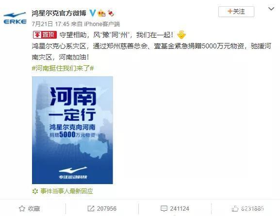
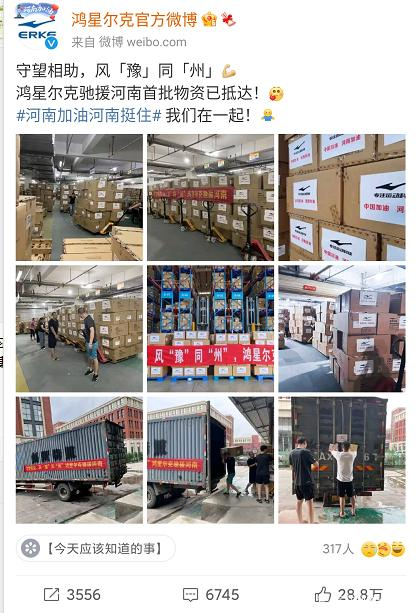
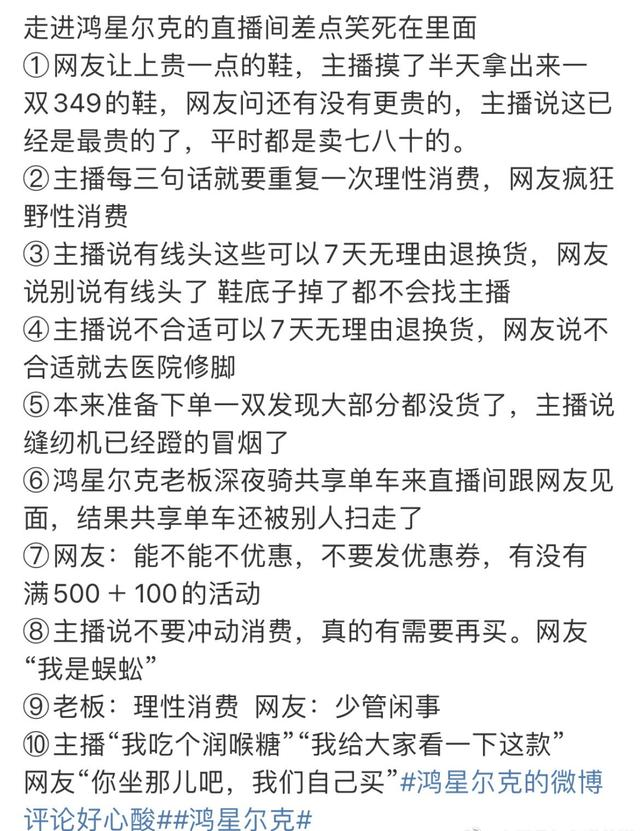
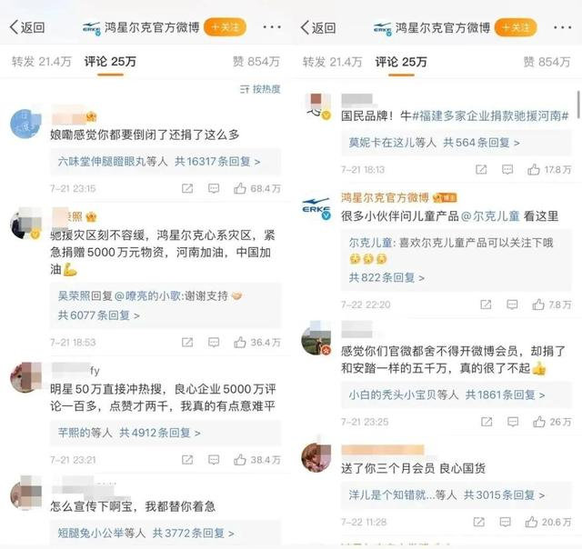

事件缘起2021年7月21日
鸿星尔克宣布向河南捐赠5000万元物资
这一消息隔天被网友发现后
迅速发酵

相关新闻引发广泛关注后

在其微博评论下方

众多网友将一条

**“感觉你都要倒闭了还捐了这么多”**

的评论顶上了热评第一

网友纷纷表示：

**你支持河南**

**我支持你！**

01

**鸿星尔克官方微博，会员已经被续了100多年**

鸿星尔克，还是我上中学那会出现的一个品牌，感觉已经好多年没有关注了，而它今天做了一件事：**向灾区捐赠5000万元物资，驰援河南！**

这两天河南受灾，很多爱心企业都在出手援助，但一下捐出5000万物资，而且是鸿星尔克这种已经被阿迪耐克埋没的国产品牌，真的很不容易。

很多人感觉鸿星尔克这几年都快倒闭了，连广告都很少看到，生意不好还默默捐了五千万，一些行迹恶劣的明星都能上热搜，为什么这种爱国品牌就不能？

**面对这种低调做好事的企业，很多网友自发宣传，硬是把鸿星尔克给顶到了热搜第一。**

然后有细心的网友发现，鸿星尔克的微博账号居然连会员都没舍得开。

有人看不下去了，自费给鸿星尔克充了三个月微博会员，然后一发不可收拾，不断有人给鸿星尔克续费，截止到发文前，**鸿星尔克的微博会员已经被续了100多年，有效期到2140年4月！**

**▲鸿星尔克官微的会员已经被续到2140年**

02

**直播间一夜爆火**

22日晚

鸿星尔克的直播间里

也涌进了许多网友

此前

鸿星尔克直播观看数仅几千

**22日晚直播观看数达到了201万**

**直播间粉丝量也增至763万**

大量消费者涌入鸿星尔克直播间

购买产品

主播多次提醒“**理性消费**”

网友：不！我偏要野性消费！

网友们开始纷纷喊话：

**要野性消费！**

7月23日凌晨，

直播快要结束时，

斯文帅气的老板

凌晨急忙赶到了直播间。

**除了感谢大家的支持厚爱，**

**却没有一句带货的话。**

**临走还不忘一直劝大家：要理性消费，要多关注灾情。**

有人去老板微博求他宣传下，才能赚大钱。

老板认真回复：

**“面对灾难，能做的有限，尽自己的力量就好，把宣传资源留给更需要被关注的灾区。”**

网友表示，

看了老板的发言终于知道为什么这个牌子这么低调了...

自己野性捐款，

却劝大家要理性消费；

**还有网友表示，**

**让你们老板抓紧生产少管闲事。**

甚至，连阿迪直播间都倒戈了。

03

**鸿星尔克7月23日**

**销量增长超52倍**

京东发布报告显示，22日、23日两天国潮运动品牌的整体销售额同比增长超过280%。

其中，跑步鞋、篮球鞋、运动裤、T恤等成为销量最高的品类，鸿星尔克、安踏、361度、匹克等国潮运动品牌销售暴涨，位居销售规模前列。

**值得注意的是，国潮品牌鸿星尔克23日当日销售额同比增长超52倍。**

据新抖数据显示，“鸿星尔克品牌官方旗舰”于7月22日中午在抖音开始的这场马拉松式直播，截至预估销售额破亿时，**总销量已达到61.29万，单场涨粉709.35万，单场获赞4.28亿，在线峰值人数87.07万，累计观看人次达到1.48亿**，相当于**每10个中国人就有1个**在过去两天里去过这个小小的直播间（按人次计算）。

就在今天凌晨2点多，6万多人同时在鸿星尔克的直播间去下单购买。

与此同时，“鸿星尔克店播专卖店”、“鸿星尔克童装官方旗舰店”、“鸿星尔克鞋服”等相关账号也在抖音同步开播，据新抖数据，截至发稿前，以上3个账号近两天累计的直播销售额近6000万元。

直至发稿前，鸿星尔克直播间的网友们仍在“野性消费”，**当季存货被抢空的鸿星尔克官方也上架了更多秋冬商品。**

04

**为何鸿星尔克只捐5000万，就感动了亿万网友**

这次河南水灾，捐款的企业很多，例如阿里、腾讯、字节跳动、美团、滴滴、拼多多、牧原股份、富士康等公司，就均有亿元及以上捐赠。**而“一家快倒闭的企业”鸿星尔克，也跟着捐了5000万。**

**为何鸿星尔克只捐了5000万，就感动了亿万网友？**

其实看一眼网友们的评论，大家心里基本就明白了！

在上面这几则风轻却不云淡的留言中，细心的朋友可以发现，鸿星尔克这几年的日子并不好过。

在网上随便一搜已经公开的数据，我们可以看到，**他们今年第一季度净利润的数据，是负6000多万；**

**再往前，他们全年的净利润为负2.2亿。**

这也是为什么很多网友心酸地说，“感觉你们就快要倒闭了”的缘由。

而鸿星尔克的几家竞争对手，赫赫有名的李宁，2020年净利润17亿，朴素无华的361°，2020年净利润4.2亿；一本正经的安踏，2020年净利润也在56亿...

再说白了，鸿星尔克这家企业，自己本身就处于水深火热当中了，能不能活下去还难说，**河南这场水灾，他们还是低调的捐了5000万。**

也许有人会问，**这怕是鸿星尔克的一场营销炒作吧？**

怎么说，炒作的大有人在，不过鸿星尔克，**吴荣照还真的不是炒作，更不是借着灾难搞一波营销。**

譬如，在河南水灾才开始的时候，就有人怂恿吴荣照买热搜了，但吴荣照的回复是：**面对灾难，能做的很有限，尽力就好，把宣传资源留给更需要被关注的灾区吧。**

再譬如，如果不是热心网友帮鸿星尔克买微博会员，他们现在会员都不是，而我们都知道，**一个账号连会员都舍不得买，那铁定是没有流量的。**

如果是炒作的话，他们不可能不懂得这点浅显的道理，说白了，他们对网络流量这些也根本不太懂。

最直白的，莫过于直播的现场情景，**直播小姐姐就算演技再怎么高超，那份面对忽然而来的网友，所表现的不知所措，是演不出来的；老板被惊动进入直播间的仓促，这个脚本也不是一般人能写出来的。**

最主要的是，鸿星尔克并不是这一次捐款，以前捐得也很多，也同样低调：

> 2008年，鸿星尔克就为汶川地震捐了600万；

> 2013年，鸿星尔克与福建省残联基金会携手，捐赠了超过2500万元的爱心物资。

> 2018年，鸿星尔克向福建省残疾人福利基金会捐赠6000万元爱心物资。

> 2019年，鸿星尔克向中国残联捐款1亿元。

> 2020年，鸿星尔克向武汉捐赠价值1000万元的物资。

> 2020年4月，鸿星尔克向长泰县捐赠5万个口罩。

> 2021年，鸿星尔克捐赠1亿元物资用于扶贫助残。

> ......

再换句话说，这是一个有情怀的人，据悉，鸿星尔克成立之初，一场台风让工厂变成汪洋，库存里的鞋子被浸泡，曾让企业面临过巨大的危机。

对此有网友评论：**“他自己淋过雨所以想给别人撑把伞”。**

----

为什么捐个款，就能大幅度提高销量，知名度？为什么会有这些现象？

> 《佛说轮转五道罪福报应经》云：
> 
> 为人大富。财物无限。从布施中来 

根本原理，在于财布施得财富，
这是佛发现的，客观存在，永恒不变的事实规律，
即使鸿星尔克老板吴荣照没学佛，不知道这个自然规律，
只要布施了，都能获得财富，

就好比张三，没学过农学，只要按照自然规律播种，有土壤水分阳光，就能收获果实，

